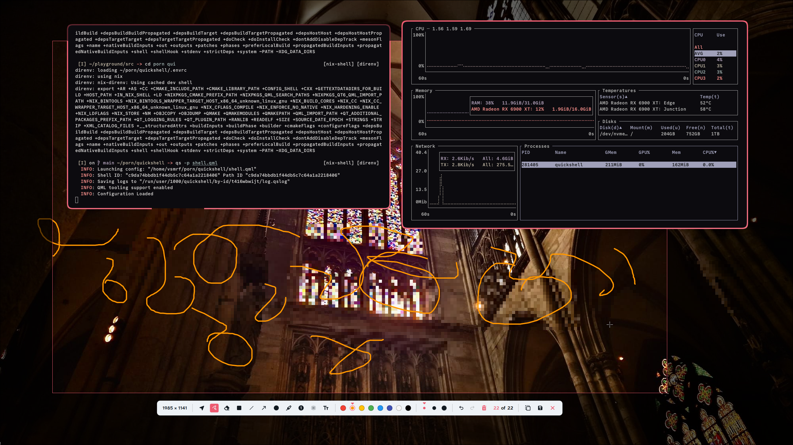

<h2>Snippy</h2>

Screenshot utility written with Quickshell

 

## Features
+ Select shapes on canvas (move shapes)
+ Freehand drawing
+ Eraser
+ Rectangle (filled, outlined)
+ Line
+ Arrow
+ Ellipse (filled, outlined)
+ Marker
+ Steps
+ Blur
+ Textarea with line breaks and modifiable
+ Canvas Actions (undo, redo, clear all)
+ Themable

## Installation
### Nix
todo

### Manual
todo
#### Dependencies
+ Qt 6.10+
+ Quickshell 0.3.0+
+ Your compositor must support wlr-screencopy-unstable or both ext-image-copy-capture-v1 and ext-capture-source-v1 
+ [KDE/kirigami](https://develop.kde.org/frameworks/kirigami//)

## Usage
todo

## Acknowledgements
+ [soramane](https://github.com/soramanew) special thanks to sora for showing how to do stuff
+ [KDE/spectacle](https://github.com/KDE/spectacle) ui and backend inspirations
+ [Furkanzmc/QML-Coding-Guide](https://github.com/Furkanzmc/QML-Coding-Guide) 
+ [Quickshell](https://github.com/quickshell-mirror/quickshell)

## Todos
- [ ] Thickness spinbox
- [ ] Steps editable spinbox
- [ ] Follow user's qt system theme
- [ ] Draggable toolbar?
##### after 1.0
- [ ] Color picker
- [ ] Marker shapes
    - [x] rectangle
    - [ ] freehand
- [ ] Resizing shapes (if i don't have skill issue (prayge))

## Notes
+ Eraser tools can only erase <ins>**a**</ins> shape. Meaning you can't have "freehand" eraser like in popular paint software [^1]

+ For the "copy to clipboard" to work you need to have a persistent clipboard manager installed like [cliphist](https://github.com/sentriz/cliphist), [wl-clip-persist](https://github.com/Linus789/wl-clip-persist), [stash](https://github.com/NotAShelf/stash), etc... (not guaranteed lol)

+ Memory usage while the app is running
<figure>
  
  <figcaption>with 10 blurring rectangles and 12 freehand drawings</figcaption>
</figure>

[^1]: potentially skill issue from my side
