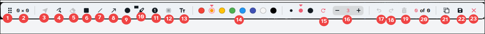

<div align="center">
<h2>Snippy</h2>
<p>Screenshot utility written with Quickshell</p>
</div>

<br>


https://github.com/user-attachments/assets/a61ec2e9-8bd4-44bf-850e-cdc9709d77f1


## Features
+ Movable and resizable selection rectangle
+ Select annotation on canvas (move annotation)
+ Freehand drawing
+ Eraser
+ Rectangle (filled, outlined)
+ Line
+ Arrow
+ Ellipse (filled, outlined)
+ Marker
+ Steps
+ Blur
+ Textarea with line breaks and modifiable
+ Canvas Actions (undo, redo, clear all)
> [!NOTE]
> Currently I don't have hardware to test whether multimonitor works. Feel free to open a pr


## Installation
### Nix
Try out without installing:
```
nix run github:Iamvismorf/Snippy
```
<br>

> [!NOTE]
> As of 22.08.26 the Kirigami package in unstable nixpkgs has a regression where icons appear smaller than they should be. `inputs.nixpkgs.follows` is not recommended. If you want to use `follows`, override kirigami to version 6.26 
```nix
{
  inputs.snippy.url = "github:Iamvismorf/Snippy";
  #...
}
```
The package is available as `inputs.snippy.packages.<system>.default`


### Manual
todo
#### Dependencies
+ Qt 6.10+
+ Quickshell 0.3.0+
+ Your compositor must support wlr-screencopy-unstable or both ext-image-copy-capture-v1 and ext-capture-source-v1 
+ [KDE/kirigami](https://develop.kde.org/frameworks/kirigami//)

## Usage
- Left click to select; left click again to deselect


1. Drag the toolbar. Will be reset to it's default position after the selection rectangle is transformed i.e. positon changed or resized
2. Selection rectangle size
3. Select an annotation. Can only select and move 1 annotation at a time. Available when there is at least 1 annotation on the canvas
4. Freehand drawing
5. Eraser. Available when there is at least 1 annotation on the canvas. Also see [notes](#notes)
6. Rectangle. Defaults to filled. Right click to change mode
    - filled
    - outlined
7. Line
8. Arrow
9. Ellipse. Defaults to filled. Right click to change mode
    - filled
    - outlined
10. Marker. Defaults to rectangle. Right click to change mode
    - rectangle
    - freehand draw
11. Numbering. Use the spinbox to control the next number
12. Blur
13. Text
    - on hovered: shows the textarea will be focused when left clicked
    - Enter: creates new line
    - Esc: unfocus the textarea
14. Palette
15. Reset the selected thickness to default if was modified
16. Modify the selected thickness
17. Undo(Ctrl+z). Available if current canvas step is not 0. See 20
18. Redo(Ctrl+y). Available if current canvas step is not the last. See 20
19. Clear the canvas. Available when there is at least 1 annotation on the canvas
20. The canvas history. Highlighted shows the current step
21. Copy to clipboard(Ctrl+c). Also see [notes](#notes)
22. Save to configured path(Ctrl+s)
23. Exit(Esc)

### Configuration
Launch snippy for the first time and it will generate ~/.config/config.json and ~/Screenshots. Or create one manually.
The defaults are:
```json
{
    "general": {
        "fontFamily": "Atkinson Hyperlegible Next",
        "fontFamilyStyle": "SemiBold",
        "minSelectionRectangleHeight": 20,
        "minSelectionRectangleWidth": 20,
        "saveFolder": "Screenshots",
        "showToolTip": false
    },
    "theming": {
        "accent": "#ed5a70",
        "black": "#121a21",
        "gray": "#c0c2c4",
        "lightGray": "#d6d9db",
        "red": "#ed5a70",
        "white": "#eef2f6"
    },
    "toolbar": {
        "ellipse": {
            "defaultToFilled": true
        },
        "highlight": {
            "defaultToRectangle": true
        },
        "rectangle": {
            "defaultToFilled": true
        }
    }
}
```
> [!NOTE]
> Don't forget to remove comments when copying the above defaults


## Acknowledgements
+ [soramane](https://github.com/soramanew) special thanks to sora for showing how to do stuff
+ [KDE/spectacle](https://github.com/KDE/spectacle) ui and backend inspirations
+ [Quickshell](https://github.com/quickshell-mirror/quickshell)
+ [Furkanzmc/QML-Coding-Guide](https://github.com/Furkanzmc/QML-Coding-Guide) 

## Todos
- [ ] Color picker
- [x] Marker shapes
    - [x] rectangle
    - [x] freehand
- [ ] Resizing shapes (if i don't have skill issue (prayge))
- [ ] Snap for some shapes (line, arrow, drawing)


## Notes
+ Eraser tools can only erase <ins>**a**</ins> shape. Meaning you can't have "freehand" eraser like in popular paint software [^1]

+ For the "copy to clipboard" to work you need to have a persistent clipboard manager installed like [cliphist](https://github.com/sentriz/cliphist), [wl-clip-persist](https://github.com/Linus789/wl-clip-persist), [stash](https://github.com/NotAShelf/stash), etc... (not guaranteed lol)

+ Memory usage while the app is running
<figure>
  
  <figcaption>with 10 blurring rectangles and 12 freehand drawings</figcaption>
</figure>

[^1]: potentially skill issue from my side
